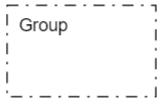
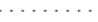
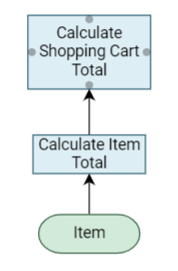
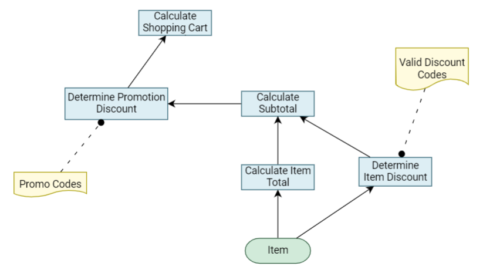

# What is DMN and where Decision Model fits into irAuthor?

With DMN Modeler extension, it is possible to create a Decision Requirements Graph (DRG) from scratch. One way to think of a DRG is the available canvas for designing the model, with the help of the palette. As the first shape is being dragged from the palette on the canvas, the Decision Requirements Diagram (DRD) is created and enriched step by step with decisions and any other elements that are being added to the model. While there can be a lot of complexity around filtered views of a DRG by using multiple DRDs according to DMN spec, our implementation supports a single DRD per DRG. This means that every time a new item is added in the "DMN Models" pane, the rule application receives a new graph and one associated diagram per item.

Compatibility summary between DMN 1.3 spec and InRule DMN extension.

DMN spec category | DMN spec sub-category | InRule Compatibility | Comments
------------ | ---------------------------------------------|---------------------|-------------------------------------------------------
Decision Requirements | DRG | Yes |
   | DRD | Partial | 1 DRD per DRG
   | Elements of a DRD: Decision, Business Knowledge Model, Input Data, Knowledge Source, Decision Service | Yes |
   | Artifacts: Text Annotation, Association, Group | Yes |
   | Dependencies between DRD elements: Information Requirement, Knowledge Requirement, Authority Requirement | Yes
Decision Logic | Decision Table - Structure: Input clauses, Output clauses, Rules, Annotation clauses | Partial | Because InRule implements natively Decision Table, it does not support DMN visualization of it. InRule does not implement Annotation clauses for Decision Table.
   | Decision Table - Hit Policy | Partial | [see more details here](../../documentation/doc/DecisionTables.md#hit-policy)
   | Decision Table - Orientation | Partial | InRule implements Horizontally orientation, with rules on rows.
   | S-FEEL Data Types and Expressions | Partial | [see more details here](../../documentation/doc/DecisionTables.md#data-types-and-s-feel)
   | FEEL | None | 
 Visual Appearance | DMN Models: zoom in, zoom out | Yes |
   | Shapes: Decision, Business Knowledge Model, Input Data, Knowledge Source, Expanded and Collapsed Decision Service, Group, Text Annotation | Yes |
   | Connectors: Requirement, Knowledge Requirement, Authority Requirement, Association | Yes |
 Connection rules when connecting DRD elements | All possible connection rules beween DRD elements | Yes | 
 Referencing external DMN elements | | None |
 External invocation of Decision Services | | None |
 DMN Diagram Interchange (DMN DI) | DMNDI, DMNDiagram, DMNDiagramElement, DMNShape, DMNEdge | Yes |
  

## Add a new DMN Model
Once the DMN extension is enabled, a new component is visible on the left navigation pane of irAuthor, named “DMN Models”. To create a DMN Model from scratch, navigate to the DMN Models component and press the Add button (just as you would do in any other component of the navigation pane: Entities, Rules, Decisions, etc.). 

 

Renaming and removing models in the "DMN Models" component also works in the same way as renaming and removing items in the other components of irAuthor

## Modify an existing DMN Model

Once the user selects a DMN Model from the list in the left navigation pane, the canvas shows the selected model, ready to be modified. Possible modifications of the model are:
* Add a shape from the palette by drag and drop onto the canvas.
* Modify the position of a shape, with a mouse-drag from the middle area of the shape, and mouse-drop it to the desired location.
* Resize a shape by selecting the shape with a mouse click and use one of the 8 rezise handles highlighted with light blue dots arund the shape; the middle-top and middle-bottom resize handles modify the shape's height; the middle-left and middle-right resize handles modify the shape's width; the 4 resize handles in the corners resize both the shape's height and width at the same time.

   

  _**Note:**  Resizing multiple shapes at one time is not supported._

* Rotate a shape, by selecting the shape with a mouse click and use the rotating handle. To discover the rotating handle, select the shape with a mouse click and notice the upper light-blue dot (see image above)
  _**Note:**  Rotating handle is not available for Groups and Decision Services._

* Connect 2 shapes using a mouse-drag operation from one shape's port to the other shape. To discover available ports on a shape, simply place the mouse over a shape: there are 4 available ports on each shape, highlighted with grey dots. A successful link will result in a link drawn between the 2 shapes.

   

* Remove elements from the model, by selecting the shape or connector between shapes and press Delete or Backspace from the keyboard. When removing a shape that is connected to other shape, the link will also be removed from the model.
  _**Note:**  Deleting a shape or link from the model will remove the element both from the DRD and DRG of the current model._
  _**Note:**  Deleting multiple elements at one time is possible, by selecting first the elements to be removed and then pressing the Delete or Backspace key._

* Rename a shape's name: double click the shape if it's unselected, or click if the shape is selected
  _**Note:**  When adding a shape from the palette on the canvas, irAuthor automatically adds a default name of the shape, in accordance with the shape type (example: "Decision" name is assigned to a decision dragged on the canvas)._

## Delete a DMN Model
To delete a DMN Model, locate it from the available items in the left navigation pane "DMN Models", right-click and choose "Delete" option.

A confirmation dialog box appears, where the final deletion may be confirmed or cancelled.

# Import/Export of models

The menus for importing or exporting a DMN Model can be found on the Home ribbon tab, group "DMN".

 

_**Note:** The group "DMN" on the Home ribbon tab is visible only while the DMN Extension is enabled for irAuthor._

Even though current DMN spec is at 1.3 version, there is still a lot of variations across vendors, because there are some areas of the specification which are fairly open to interpretation. For this reason, there are cases where model might not import correctly or might need modifications; and the same is true for Decision Tables.

To import a DMN model from an external .dmn file, find the "Import" menu on the "DMN" group on the Home ribbon tab, and click on the menu option "Decision Model from .dmn file". This menu option is always visible and enabled, no matter what item is currently selected in the left navigation pane or what is the current context of the user's selection. 

 

Then, locate the file on the local file system and confirm the selection. Note that the file has to have the extension .dmn, otherwise an error dialog box is presented and no import is performed.

 

_**Note:**  When importing a model (DRG) that contains multiple DRDs, a best effort merge is done to flatten the DRDs into one._

If another model with the same name already exists in the rule application, irAuthor will automatically add a prefix counter at the end of the imported DMN Model name, or increment the number at the end of the name, if it ends with a digit. For example, if the rule application has a DMN Model named DMNModel1 and the model to be imported has the same name DMNModel1, after the import irAuthor will automatically increment the prefix counter and assign the name DMNModel2 to the newly imported object.

A successfull import will add a new item in the DMN Models navigation pane and will update the canvas to display the imported model.

_**Note:**  There is no report available for the import process results. In case some elements were not imported due to inconsistency or lack of support in our extension, those elements will not exist in the model, therefore will be lost._

To export a DMN Model, select the desired model from the models list and click on the "Export" menu found on the Home ribbon tab, group "DMN". Then, from the menu options availble, click on the "Selected Decision Model to .dmn file" option. 

 

# Explore shapes and connectors

Shapes represent the visual representation of every piece of information or data that help taking a decision. 

Shapes are connected by links. The links are unidirectional, having an arrow at one end. Only one exception exists to arrows: annotations are linked to shapes only with a dotted line, without having a specific direction designed with an arrow. Between 2 shapes there is only one valid link type defined by the DMN spec and irAuthor will automatically design it as soon as the connection is made by the user.

The following table lists all the shapes found in the DMN extension for irAuthor.
Shape Name | Shape Design | Description
------------ | ---------------------- | ---------------------------------------------------------------------------------------------------
Decision |  | A decision represents the act of determining an outcome from several inputs, using decision logic.
Input Data |  | Input data denotes the information needed as input by one or multiple decisions
Business Knowledge Model |  | A business knowledge model represents reusable business logic. Technically, it is a function with optional parameters (inputs) that can be invoked from decisions or other business knowledge models.
Knowledge Source |  | Knowledge sources represent authorities for a decision, for a business knowledge model or for another knowledge source. These can e.g. be policies, regulations or people that have an influence on the contents of the element.
Annotation |  | Are simply notes to any of the shapes that are not containers for other shapes: decisions, input data, knowledge source, business knowledge model. Any text can be inserted into annotations. Usually they are associated with sticky notes, or a sort of container for additional attributes for the shape (like owner, or due date).
Group |  | A Group is a way to capture information during modelling requirements. Groups can be added or removed from the diagram, without having an impact on the decision model execution. Exemple of situations when a group might be useful: when a discussion is around a certain subject, so  related shapes to that subject are put visually together, without the need to connect them; or when the highlighted property for a group of shapes is the owner.
Decision Service |  | Decision Service encapsulates the decision logic, by providing a public and a private interface, that correspond to subsets of decisions respectively of decisions and input data.
Simplified Decision Service |  | Simplified Decision Service is similar to the Decision Service, except that fact that it does not differentiate between public and private decisions.

The following table lists the visual representation of all possible links, when connecting 2 shapes. Not every 2 shape types can be connected, but only those ones meaninful to decision logic. See also the following table, listing those valid connections.

Connector Name | Connector Design | Description
----------------------- | --------------------------------- | -------------------------------------------------------------------------------------------------------------------
Information Requirement |  | Information Requirement denotes Input Data or Decision output being used as input to a Decision
Knowledge Requirement |  | Knowledge requirements are like information requirements, but are used to indicate the invocation of a business knowledge model.
Authority Requirement |  | They are drawn between knowledge sources and other elements to indicate that the knowledge source has an influence there, i.e. is an "authority" for it.
Association |  | They connect a text annotation to an input data, decision, business knowledge model or knowledge source.

_**Note:**  There is no constraint on the number of shapes or links you can use in a decision requirement diagram; you can design the DRD using the needed shapes and the most adequate position for each one of them, but take in consideration that a functional DRD should have all the shapes connected._

# Step by step guide on how to design a decision model

[draft]
Now that decision graph, decision diagram and shapes are covered, it's time to start designing a decision model. 
There is no perfect answer to the question: "What is the first shape to add when modelling my requirements?", "When is the right moment to start a decision model?", so these are just some ideas that might work for your scenario.

Once we start discovery phase of the project lifecycle, and start putting together first requirements, this is when DMN comes into play. By starting a DMN model, you bring some sort of order in modelling requirement, because when starting a project, some informations are known, and others are missing. It's perfectly normal. 
Maybe the best way for your context is to gather all the project team and start brainstorming on what problem needs to be solved, and start from there. Or, if the project is a very complex one, start by identifying modules or bigger parts that can be analyzed individually. 

Here is a step by step guide to begin designing a decision model:
1. Start brainstorming on what problem needs to be solved.
2. Think of the decisions that, put together, will drive to problem resolution. Start a new irAuthor DMN Model and begin the design by dragging decisions identified so far and put an identification label on each.
3. Start documenting decisions identified; think of what other data is needed for the decisions to be made, in input and in output. It doesn't matter where requirements for your decisions are kept (e.g.: Jira), important is represent them visually.
4. Enrich the DMN diagram adding other connected shapes to your decisions. You may leave some shapes without being connected to others, if in doubt which or where should be connected.
5. Think if some separation between public and private decisions is needed. If so, add decision services to you model.
6. Separate shapes in groups, if a criteria brings light in your model.

As the requirements are detailed more, most probably the number of decisions and also other elements will grow. And maybe at some point, the model becomes too complex, that it needs to be spanned in more smaller models. It's not mandatory to keep one single model per project, as your project progresses. So it's important to repeat the steps above once in a while, to make sure you maintain a consistency of your models.

Here is a practical example of an online store, in need for a solution on automation of the shopping cart for their customers. The main problem to be solved is to have a system that correctly calculates a customer's shopping cart total. So let's start with this decision, calculating the total price in the standard way, price per item * quantity:

Now let's document more this decision, taking in consideration that some products might have a discount, or the customer might have some promo code on the order. We need to take that in consideration when calculating the total price. So the model can be enriched with these details.

As our mini guide above suggests, it's time to think if some decisions are public, and other private. Indeed, all the discounts and promotions calculation when determining the subtotal price is internal and we should separate that from the final price calculation. So a Decision Service can be added to our model:

As the analysis progresses, of course many other details appear, like where does this package will be shipped, what are the shipping taxes that need to be applied, maybe some customers are willing to pay more for a speedy shipping, so also that need to be considered. The important thing is that, as new ideas are brought into discussion, they need to be put on the model, to keep track of them and detail them at the right time.

Conclusion:
DMN is a critical step between identifying requirements and implementation. It's purpose is to discover models and get the value out of the decision that is automatig your business.
