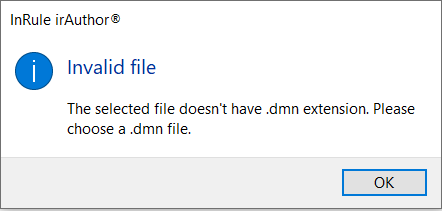

# Defining decision tables

Decision tables are the most preferred metaphor for authoring rules by business users. They are efficient. They are understandable by just about everyone without much training. Moreover, many business analysts are accustomed to presenting requirements in a tabular format. For these reasons, we believe decision tables are what rule authors are most likely to use when sharing rules between teams and organizations using DMN.

As a simple example to get started with DMN and decision tables, consider the decision of what to wear before leaving the house. Some things you might consider when making this decision are the season, the temperature outside, and maybe the weather predictions in the following hours. All these considerations may be modelled as inputs of a decision table. The output of this decision table would be "what to wear". But you might also determine that you ought to carry an umbrella with you. Whether or not to carry an umbrella could become a second output of the decision table.

In irAuthor®, the components of a decision table are:
  * Conditions - each condition is a representation of an input data for the decision. A valid decision table has at least one condition.
  * Actions - each action is a representation of an output or result for the decision. A valid decision table has at least one action.
  * Decisions - the set of all possible values which, together, make the decision logic. Each decision row in the table represents a rule.
  * [Hit policy](DecisionTables.md#hit-policy) - governs if one or multiple rules may be validated by the matching algorithm, and in case multiple rules are allowed, in what order they are returned.
 
 Having the example above, this is how a decision table would be defined in irAuthor.

 

View the complete [.dmn file of "WhatToWear" decision table](../samples/InRuleDMN_SampleDecisionTable_WhatToWear.dmn). It can be opened in Notepad or any other tool which supports DMN to view the contents and our level of DMN conformity.

Notice that our example has two actions. Whenever this decision table is executed, it will return the actions defined in the table. The hit policy determines how the rows are processed by the engine. InRule's DMN Modeler supports DMN's "First" policy which means the engine will quit processing downstream rows once it encounters the first row who's criteria columns are matched. In the case of DMN's "Rule Order", the engine is also able to process all rows of the table in sequential order. In this case, the action columns are likely to be over-written multiple times with the last row executed having the last say in the final output. Hit polices for DMN are detailed in a table below for more detailed explanation.

There are cases when a value of a cell may be ignored at run-time. In those cases, at design-time that cell can be set to "Any". For example, if it's summer, I won't take any coat, no matter what the outside temperature is. Use of "Any" allows for a rule author to create interesting patterns where decision tables progressively add more specific criteria -- like a funnel. The first row might have all criteria cells set as "Any" assuring the first row determines a default outcome. Downstream rows add more criteria. In other cases, "Any" allows for a convenience when a given criteria simply isn't relevant to a particular scenario. It is possible that no criteria columns match. In this case, the engine will continue processing without firing any actions from the decision table. According to the DMN statndard, "Any" criteria columns export as empty cells. Likewise, action cells with "Ignore" export as blank cells.

# Hit policy

Depending on how your conditions were written, it may sometimes happen that more than one rule in a decision table matches the inputs provided to it. When that happens, the decision table will need a hit policy to determine which of the matching rules should be executed. If it is your intention to design your conditions in such a way that there can never be more than one rule matching the inputs, a hit policy can also help you determine if you have indeed designed it that way.

The table below explains all the possible DMN hit policies:

InRule support | Hit policy | Explanation
-----|---------------------|----------------------------------------------------------------------------------------------------------------------------------------
   | Unique | For any given condition values, there is only one rule that matches and that will be the output of the decision. One rule is the output of the decision.
   | Any | If input values match more than one rule, all the corresponding actions are identical, so any of them is correct to be returned as result. 
   x | First | If, for the same input values, multiple different actions are matching, then the first set of action values is returned. In this case, the order in which rules are checked determines one result or another.
   | Priority | If, for the same input values, multiple different actions are matching, then the actions whose values have the highest priority are fired. Priorities are determined from the available values of each action, who are listed by convention from high-priority to low-priority. One rule is the output of the decision.
   | Output Order | If, for the same input values, multiple different actions are matching, they are all returned in decreasing order of priority. Priorities are determined from the available values of each action, who are listed by convention from high-priority to low-priority.
   x | Rule Order | If, for the same input values, multiple different actions are matching, they are all fired in rule order.
   | Collect | If, for the same input values, multiple rules are matching, they are all fired in arbitrary order.
   | Collect (Sum) | Same as collect, only that it applies the sum operator of all matching outputs.
   | Collect (Minimum) | Same as collect, only that it applies the min (or smallest, depending on the context) operator of all matching outputs.
   | Collect (Maximum) | Same as collect, only that it applies the max (or largest, depending on the context) operator of all matching outputs.
   | Collect (Count) | Same as collect, only that it applies the count operator to count all matching outputs.

When importing a decision table from a .dmn file, "First" hit policy is honored. All others map to "Rule Order" (multiple hits). The checked flag "Exit at first true" on the decision table definition represents the "First" hit policy.

## Data types and S-FEEL 

Condition definition implements Simple Friendly Enough Expression Language (S-FEEL) specification. Condition's linked field can be a variable of primary type, or an entity field. 
When bound to a primary type variable, one of the data types can be used or mapped during import of a decision table:

S-FEEL Data Type | InRule Data Type | Comments | Import/Export supported patterns
---------------|--------------------|------------------------------|---------------------------------------------------------------------------------------------------------
Number | Integer, Decimal | Holds a numeric value; are allowed comparisons and expressions like is in an interval. | 10, > 10, >= 10, < 10, <= 10, [2..10], (2..10], [2..10), ]2..10[
Boolean | Boolean | Holds a boolean value. | true, false
String | Text | Any sequence of chars; are allowed expressions like string is equal to, among, or not equal to. | "Winter", not("Summer"), Not Fall
Date | Date | Has 3 parts: year, month and day. | date("2021-08-19")
Time | - | On import, value is converted to Text data type and imported as a string. | any pattern, including time("09:10:11.123+01:00")
Date and Time | DateTime | A date together with the time expressed in hours, minutes and seconds. | date and time("2021-08-19T09:10:11")

# Import/Export
The menu options for importing and exporting decision tables are in the same group "DMN" on the Home ribbon tab, as for importing and exporting DMN models.

 

Decision tables can be imported from an external .dmn file. There is no restriction related to the number of decision tables that can be imported into irAuthor; the import will make the best attempt to import all the decision tables found in the referenced file. First, the user has to select from the left navigation pane, the tab "Decisions" and then select the specific Decision definition node or Decision rule set node where the imported objects will be placed. Once this selection is made, the "Import" -> "Decision Table(s) from .dmn file" option from the ribbon menu will be enabled. After clicking on the menu option, the user will be prompted to choose a local file with .dmn extension. 

 

If the chosen file has a different extension than .dmn, an error dialog box is presented and, similarly to the behavior when importing a DMN model, no import is performed.

 

After the confirmation on the file to be imported, irAuthor will perform two operations:
1. Import the decision table(s).
2. For each column from the imported decision table(s), automatically create inputs and outputs for the currently selected decision. So for example if the imported decision table has the temperature outside and chance of rain as input data, then two variables will be defined for the selected decision. irAuthor will automatically modify the name of duplicate decision table names. 

While exporting decision tables you should consider the following:
- If the user selection is a decision rule set, then all the decision tables from there will be exported to a single .dmn file.
- If the user selection is a specific decision table, then only the selected target will be exported to a .dmn file.

Actions and conditions that contain custom expressions or business language will not export to DMN decision tables.
We do support S-FEEL expressions for primary data types of the fields, so when conditions are exported to DMN, all the needed properties and field attributes will be included.
